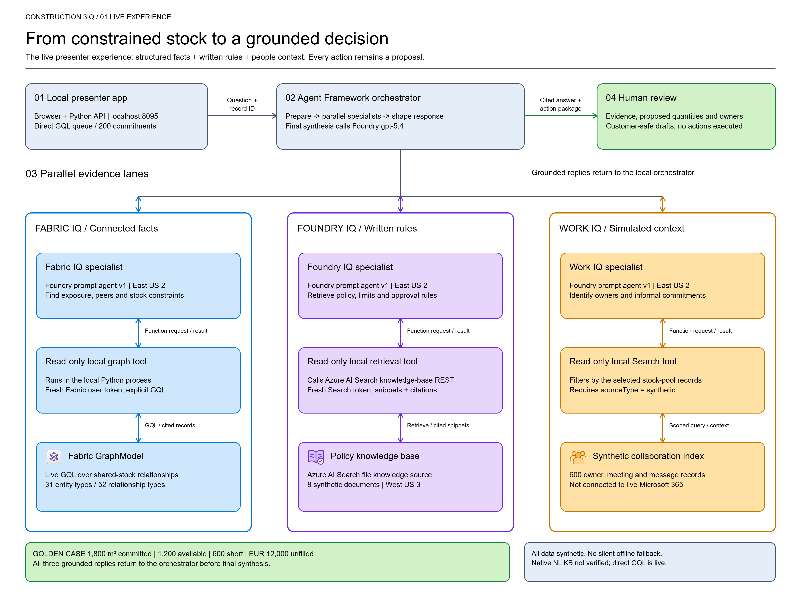
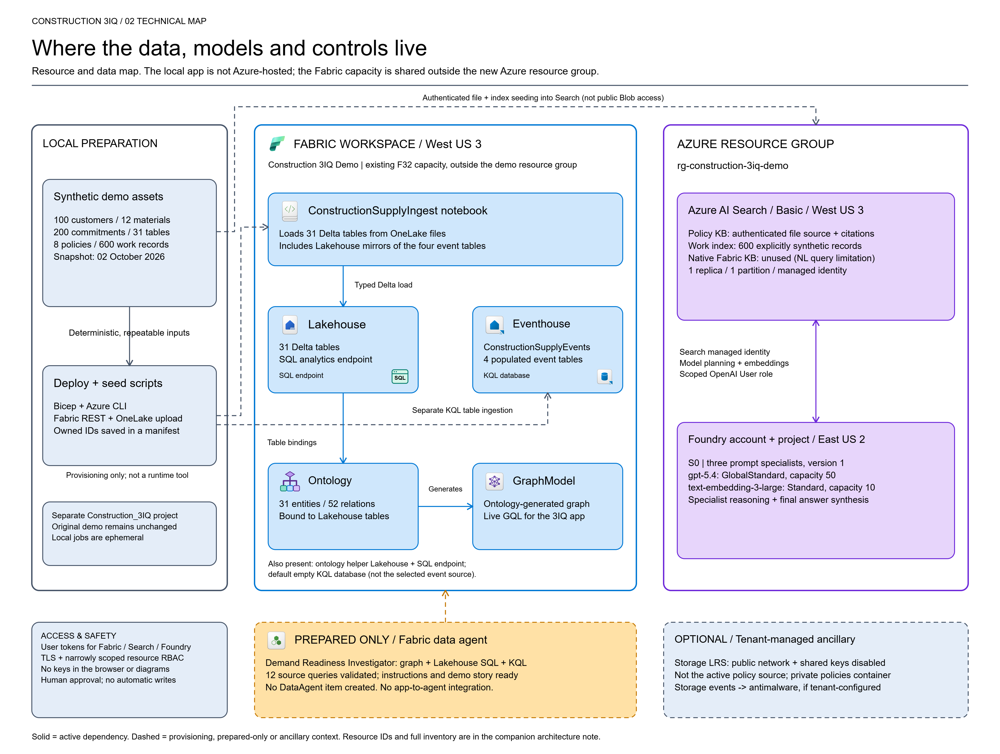
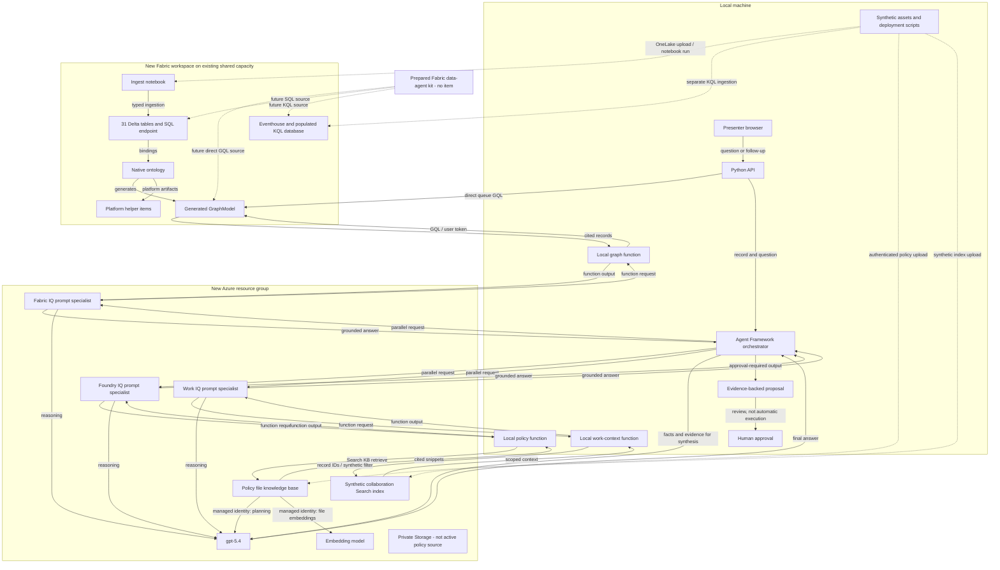

# Construction 3IQ reference architecture

This public architecture describes the sample's logical components and reference deployment shape. It does not expose a shared Azure/Fabric environment or include the original tenant's resource IDs. Resolve actual names and IDs from your own ignored deployment manifest.

## Live experience



[Vector SVG](construction-3iq-overview.svg) | [High-resolution PNG](construction-3iq-overview.png)

The browser calls the local Python API. The commitment queue is loaded directly from the ontology-generated GraphModel with GQL, without an LLM. Microsoft Agent Framework runs three remote Foundry prompt specialists in parallel.

Each specialist requests its allowed read-only evidence function. That function runs in the local application, queries the appropriate source using the caller's credentials, and returns evidence to the specialist. The orchestrator combines the grounded replies and calls `gpt-5.4` for final synthesis.

Outputs are proposed allocations, evidence, owners and customer-safe drafts. The app does not send messages, approve substitutions or change orders. Follow-up questions reuse the selected run's evidence.

## Resource and data map



[Vector SVG](construction-3iq-technical.svg) | [High-resolution PNG](construction-3iq-technical.png)

[Editable Excalidraw source](construction-3iq-architecture.excalidraw) contains two named frames. Open it in a compatible Excalidraw editor. All 11 icon assets are embedded; the file does not require access to this repository when opened.

### Visual conventions

- Blue: Fabric facts, ontology and graph.
- Purple: Foundry models and policy retrieval.
- Amber: simulated work context or explicitly prepared-only components.
- Green: human-reviewed outputs.
- Grey: local tooling, provisioning and ancillary context.
- Double-headed arrows: request/result exchange.
- Dashed connectors/borders: provisioning-only, prepared-only or ancillary context, as labelled.

Labels remain black and container backgrounds transparent. Official Fabric icons retain their original artwork and proportions. [Icon sources and license](icons/README.md) explain the original illustrative symbols used where no appropriate official icon was available.

## Reference resource inventory

| Component | Reference shape | Notes |
| --- | --- | --- |
| Local presenter app | Python 3.11+, static HTML/JavaScript, loopback port 8095 | Not an Azure-hosted web app |
| Foundry account/project | AIServices S0, East US 2 | Three prompt specialists with explicit versions |
| Chat deployment | `gpt-5.4`, GlobalStandard, capacity 50 | Specialist reasoning, policy planning and final synthesis |
| Embedding deployment | `text-embedding-3-large`, Standard, capacity 10 | Policy-file vectorization |
| Azure AI Search | Basic, one replica/partition, West US 3 | Managed identity; authenticated policy file KB and synthetic work index |
| Storage | Standard_LRS, West US 3, private `policies` container | Public network/shared keys/anonymous access disabled; not the active policy ingestion source |
| Fabric workspace | New isolated workspace on a separately selected existing F32 | Capacity is shared, outside the sample resource group's ownership |
| Lakehouse + SQL endpoint | `ConstructionSupplyLakehouse` | 31 typed Delta tables, including four event mirrors |
| Notebook | `ConstructionSupplyIngest` | Typed ingestion from uploaded OneLake files |
| Eventhouse + populated KQL DB | `ConstructionSupplyEventhouse` / `ConstructionSupplyEvents` | Four business event tables, 100 seeded rows each |
| Default Eventhouse KQL DB | Automatically created with Eventhouse | Not the selected populated business-event database |
| Ontology | `ConstructionSupplyOntology` | 31 entity types / 52 relationship types |
| Ontology-generated GraphModel | Discover its actual ID after deployment | Active live GQL source for the reference demo |
| Ontology helper Lakehouse + SQL endpoint | Platform-generated | Supporting items, not additional independent business sources |
| Storage-associated Event Grid/antimalware | Optional tenant-managed ancillary resources | Observed in the reference environment; not created or required by the sample templates |
| Fabric data agent | Preparation only | No item or app integration is provisioned |

### Status distinctions

- **Fabric IQ:** real ontology-generated graph queries in explicit `ontology_graph` mode.
- **Foundry IQ:** real Search KB retrieval over eight synthetic policy files.
- **Work IQ:** synthetic collaboration records, not a live Microsoft 365/Work IQ connection.
- **Native ontology natural-language KB:** an optional configured source whose success must be validated separately. The reference environment used graph mode after native-NL errors.
- **Offline mode:** explicitly selected synthetic fixtures; never a silent substitute for a failed live call.
- **Policies:** authenticated Search file ingestion, not public Blob access.

## Source-native connections



## Data and access boundaries

- All business data is fictional. The 2026-10-02 scenario snapshot is not a real-time feed.
- Shared stock and inbound balances are counted once per pool/delivery. Graph and Lakehouse event mirrors are not extra events to add to KQL counts.
- Runtime cloud clients obtain user tokens for the configured subscription. Credentials are never stored in the browser, diagrams or tracked configuration.
- The Search managed identity has scoped model permissions. A Blob reader role does not bypass disabled Storage network access.
- The current templates use authenticated public Search/Foundry endpoints and do not create a VNet or private endpoints. Reassess networking before using real data.
- Resource regions are not a single-region inference guarantee; the model deployment uses GlobalStandard.
- No custom MCP server, Application Insights, Log Analytics, Azure-hosted frontend or Key Vault is provisioned by this sample.
- The [Fabric data-agent preparation kit](../data-agent/README.md) is a separate proposed investigator, not an automatically invoked fourth specialist.

## Maintain the drawings

```powershell
node scripts\generate_architecture_diagrams.mjs
```

The generator uses Node built-ins and the licensed local [icon assets](icons/README.md). It produces matching SVG and Excalidraw files. Re-export the PNGs from the updated SVGs when changing the drawings; do not leave stale raster images in a publication.

The current PNGs are 4,400 pixels wide. SVG text fit and icon rendering were checked, and the editable source retains separate shapes, labels, arrows and embedded icon images.
